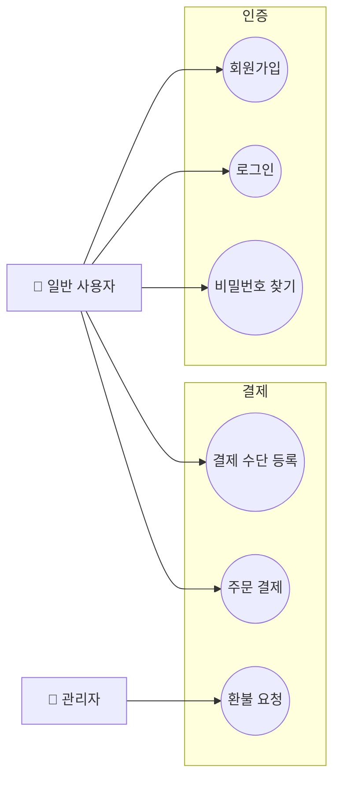

# usecase-diagram-gen

기획 문서, RFP, 메모 등 어떤 형태의 원본 문서라도 받아서 **도메인 경계 기반 유즈케이스 다이어그램**을 Mermaid 형식의 MD 파일로 만든다. Mermaid에는 UML 유즈케이스 다이어그램 타입이 없으므로 `flowchart` + `subgraph` 조합으로 근사한다.

---

## 지원 입력 형식

| 형식 | 처리 방식 |
|------|-----------|
| `.pdf` | 내장 Node.js 스크립트로 텍스트 추출 후 분석 |
| `.txt` | 직접 읽어서 분석 |
| `.md`  | 직접 읽어서 분석 |

그 외 파일 형식은 지원하지 않는다. 사용자에게 위 세 가지 중 하나로 변환해달라고 안내한다.

---

## 실행 절차

### Step 0 — 모드 감지

실행 시작 시 워크스페이스 루트에 `usecase/` 폴더가 이미 존재하는지 확인한다.

- **`usecase/` 없음** → **신규 생성 모드**: Step 1부터 순서대로 진행
- **`usecase/` 있음** → **업데이트 모드**: 아래 [업데이트 모드 상세 절차](#업데이트-모드-상세-절차)로 건너뜀

### Step 1 — 파일 확인

사용자가 제공한 파일 경로의 확장자를 확인한다.
- `.pdf/.txt/.md` 이외 → 명확한 오류 메시지와 함께 종료
- 파일이 존재하지 않으면 → 경로 재확인 요청

### Step 2 — 텍스트 추출

**PDF 입력일 때:**

```bash
# 의존성 설치 (최초 1회)
cd ~/.claude/skills/usecase-diagram-gen/scripts && npm install --silent

# 텍스트 추출
node ~/.claude/skills/usecase-diagram-gen/scripts/extract_pdf_text.js \
  <입력.pdf> -o /tmp/usecase-source.txt
```

추출된 `/tmp/usecase-source.txt`를 Read 도구로 읽어 분석에 사용한다.

**TXT/MD 입력일 때:** Read 도구로 직접 읽는다.

### Step 3 — 도메인 분석

텍스트에서 아래 항목을 식별한다:

1. **액터(Actor)**: 시스템을 사용하는 역할 (예: 일반 사용자, 관리자, 외부 시스템)
2. **도메인(Domain)**: 기능적으로 유사한 유즈케이스의 집합 (예: 인증, 결제, 콘텐츠 관리)
3. **유즈케이스(Use Case)**: 각 도메인 내 구체적인 사용자 행동

도메인은 4-8개 수준으로 나누는 것이 가독성에 좋다. 너무 세분화하거나 하나로 합치지 않도록 균형을 잡는다.

분석 결과를 먼저 텍스트로 정리해두면 다이어그램 작성이 수월하다:
```
[도메인: 인증]
- 액터: 일반 사용자
- 유즈케이스: 회원가입, 로그인, 비밀번호 찾기, 소셜 로그인

[도메인: 결제]
- 액터: 일반 사용자, 관리자
- 유즈케이스: 결제 수단 등록, 주문 결제, 환불 요청, 결제 내역 조회
```

### Step 4 — Mermaid 다이어그램 작성

`references/mermaid-usecase.md`를 참고해 다이어그램을 작성한다.

기본 구조:


- 전체 overview 다이어그램 1개 + 도메인별 상세 다이어그램 생성
- 도메인이 5개 이상이면 overview는 각 도메인의 핵심 유즈케이스 2-3개만 표시해 가독성 유지

### Step 5 — 결과물 저장

워크스페이스 루트(사용자가 현재 작업 중인 프로젝트 루트)에 아래 구조로 저장:

```
usecase/
├── README.md               ← 도메인 목록, 액터 설명, 파일 링크
├── overview.md             ← 전체 도메인 overview Mermaid 다이어그램
├── [도메인명]-usecase.md   ← 도메인별 상세 Mermaid 다이어그램
└── extracted/              ← PDF 입력 시만 생성
    └── source.txt          ← PDF에서 추출한 원본 텍스트
```

파일명은 한국어 도메인명이라도 영문으로 변환해서 사용한다 (예: `authentication-usecase.md`).

저장 완료 후 생성된 파일 목록과 식별된 도메인/액터 요약을 사용자에게 보고한다.

---

## 업데이트 모드 상세 절차

워크스페이스에 이미 `usecase/` 폴더가 있을 때 사용하는 플로우다. 기존 다이어그램을 유지하면서 변경사항만 반영한다.

### U-Step 1 — 현황 파악

기존 파일을 모두 읽어 현재 상태를 파악한다:
- `usecase/README.md` — 도메인 목록, 액터 목록
- `usecase/overview.md` — 전체 구조
- `usecase/[도메인명]-usecase.md` — 각 도메인 상세

머릿속에 "현재 도메인 N개, 각 도메인별 유즈케이스 목록, 액터 목록"을 정리해둔다.

### U-Step 2 — 변경 내용 파악

사용자로부터 무엇이 바뀌었는지 파악한다:

- **새 문서가 있는 경우**: Step 1~3(파일 확인 → 텍스트 추출 → 도메인 분석)을 수행한 뒤, 기존 현황과 비교
- **구두 지시만 있는 경우**: 사용자 설명에서 직접 변경사항 도출

변경 유형을 분류한다:
```
[추가] 새 도메인, 새 유즈케이스, 새 액터
[수정] 유즈케이스 이름 변경, 관계 변경, 액터 연결 변경
[삭제] 유즈케이스 제거, 도메인 통합/제거
```

애매한 부분이 있으면 작업 전에 사용자에게 확인한다.

### U-Step 3 — 선택적 수정

**변경이 있는 파일만** 수정한다. 영향을 받지 않는 도메인 파일은 건드리지 않는다.

| 변경 유형 | 수정 대상 파일 |
|-----------|----------------|
| 특정 도메인 내 유즈케이스 추가/수정/삭제 | 해당 도메인 `.md` + `overview.md` (핵심 UC가 바뀐 경우) + `README.md` |
| 새 도메인 추가 | 새 도메인 `.md` 생성 + `overview.md` + `README.md` |
| 도메인 삭제/통합 | 해당 `.md` 삭제 + `overview.md` + `README.md` |
| 액터 추가/변경 | 영향받는 도메인 `.md` + `overview.md` + `README.md` |

### U-Step 4 — 변경 요약 보고

작업 완료 후 사용자에게 변경 내용을 요약 보고한다:

```
✅ 업데이트 완료

[수정된 파일]
- authentication-usecase.md: 소셜 로그인 유즈케이스 추가
- overview.md: 결제 도메인 핵심 UC 반영

[추가된 파일]
- notification-usecase.md: 알림 도메인 신규 추가

[변경 없는 파일]
- content-usecase.md, user-management-usecase.md (변경 없음)
```

---

## 참고 파일

- `references/mermaid-usecase.md` — Mermaid 유즈케이스 다이어그램 패턴, `include`/`extend` 표현, 규모별 분리 전략
