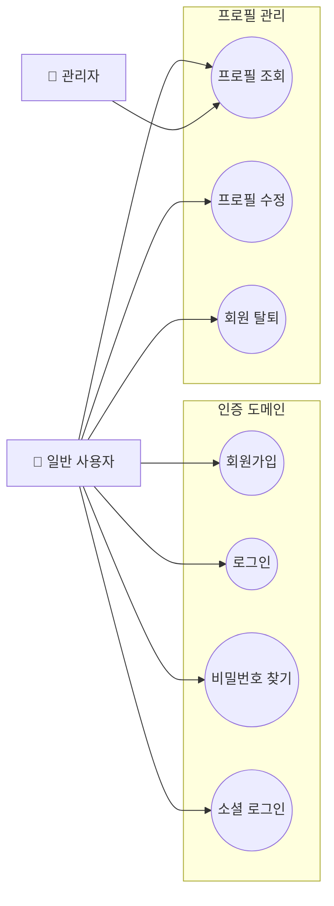
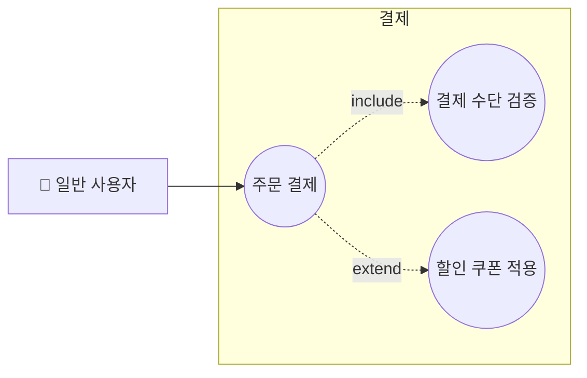
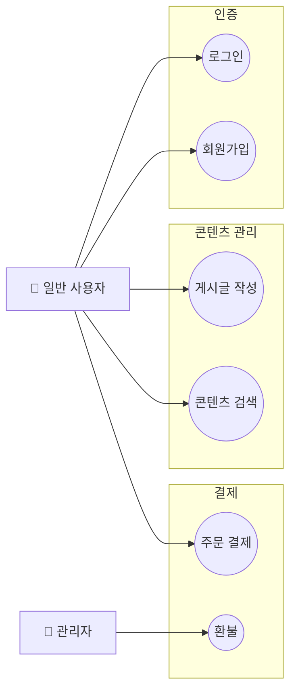

# Mermaid 유즈케이스 다이어그램 패턴 가이드

Mermaid는 UML 유즈케이스 다이어그램 타입을 공식 지원하지 않는다. 대신 `flowchart` + `subgraph` 조합으로 동일한 의미를 표현한다.

---

## 노드 타입 규칙

| UML 요소 | Mermaid 표현 | 예시 |
|----------|-------------|------|
| 액터(Actor) | `[👤 이름]` 사각형 | `user[👤 일반 사용자]` |
| 관리자 액터 | `[🔧 이름]` 사각형 | `admin[🔧 관리자]` |
| 외부 시스템 액터 | `[🔌 이름]` 사각형 | `ext[🔌 결제 PG]` |
| 유즈케이스(Use Case) | `((이름))` 이중원 | `uc1((로그인))` |
| 시스템 경계/도메인 | `subgraph 도메인명` | `subgraph 인증` |

---

## 기본 패턴



---

## include / extend 관계 표현

UML `<<include>>`와 `<<extend>>`는 점선 화살표로 표현한다.



---

## 규모별 다이어그램 분리 전략

### 소규모 (도메인 1-3개)
단일 파일로 모든 도메인을 한 다이어그램에 표현한다.

```
usecase/
└── overview.md   ← 단일 다이어그램에 전체 포함
```

### 중규모 (도메인 4-7개)
overview 다이어그램 + 도메인별 상세 다이어그램으로 분리한다.

```
usecase/
├── overview.md                     ← 전체 도메인, 핵심 유즈케이스만
├── authentication-usecase.md       ← 인증 도메인 상세
├── payment-usecase.md              ← 결제 도메인 상세
└── content-usecase.md              ← 콘텐츠 도메인 상세
```

### 대규모 (도메인 8개 이상)
overview는 도메인 간 관계만 표시하고, 도메인별 파일에 상세 내용을 담는다.

```
usecase/
├── overview.md          ← 도메인 박스만, 유즈케이스 생략
└── domains/
    ├── auth.md
    ├── payment.md
    └── ...
```

---

## overview 다이어그램 작성 요령

도메인이 많을 때 overview는 각 도메인에서 대표 유즈케이스 2-3개만 포함한다.
모든 유즈케이스를 overview에 넣으면 다이어그램이 지저분해진다.



---

## 도메인 경계 식별 기준

문서를 분석할 때 아래 기준으로 도메인을 나눈다:

1. **기능적 응집성**: 같은 데이터/리소스를 다루는 기능끼리 묶는다
   - 회원가입, 로그인, 비밀번호 변경 → `인증` 도메인
   - 게시글 작성, 수정, 삭제, 조회 → `콘텐츠` 도메인

2. **액터 관점**: 같은 액터가 주로 사용하는 기능끼리 묶어도 된다

3. **업무 단위**: 비즈니스 흐름상 한 단계를 구성하는 기능끼리 묶는다
   - 주문 → 결제 → 배송 → 반품/환불 흐름

4. **규모 균형**: 도메인 간 유즈케이스 수가 너무 불균형하면 재조정한다
   - 한 도메인에 15개, 다른 도메인에 2개라면 큰 도메인 분리 검토

---

## 파일명 규칙

한국어 도메인명은 영문으로 변환해 파일명에 사용한다.

| 도메인명 | 파일명 |
|----------|--------|
| 인증 | `authentication-usecase.md` |
| 결제 | `payment-usecase.md` |
| 콘텐츠 관리 | `content-usecase.md` |
| 사용자 관리 | `user-management-usecase.md` |
| 알림 | `notification-usecase.md` |
| 통계/리포트 | `analytics-usecase.md` |

---

## 도메인별 상세 파일 템플릿

```markdown
# [도메인명] 유즈케이스 다이어그램

## 개요

[이 도메인이 담당하는 기능 범위 설명]

## 액터

| 액터 | 설명 |
|------|------|
| 일반 사용자 | [설명] |
| 관리자 | [설명] |

## 유즈케이스 목록

| 유즈케이스 | 설명 |
|-----------|------|
| UC-001: [이름] | [설명] |
| UC-002: [이름] | [설명] |

## 다이어그램

\`\`\`mermaid
flowchart LR
    ...
\`\`\`
```
